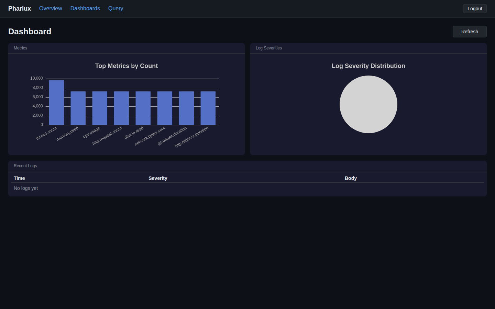

# Running Pharlux on a $20/month VPS

*Last updated: 2026-07-06 · Pharlux v1.2.0 · By Ian Holt*

If your Datadog bill is creeping past the comfort line — or if your Loki + Mimir + Tempo + Grafana + Alertmanager stack has become a part-time job you didn't sign up for — there *is* a third option.

This is the practical setup guide for running Pharlux on a single sub-$25/month VPS: one binary, one config file, one systemd unit, no Docker, no external databases beyond embedded SQLite. By the end you will have an OpenTelemetry-native ingestion endpoint (OTLP gRPC and HTTP/protobuf), durable storage, and SQL across metrics and logs through Apache DataFusion. Setup is about thirty minutes.

<!-- truncate -->

## The honest math

Three options for a small team running 5 services:

| Option | Monthly cost | Operational overhead |
|---|---|---|
| Datadog Pro across 5 hosts (with logs + APM) | Low-hundreds-of-dollars-per-month range, varying with retention, log volume, and APM coverage | Low — vendor operates the platform; you operate the bill |
| Self-operated LGTM stack on a 4 vCPU / 16 GB VPS | ~$50–80/month for the box, plus engineer-hours to operate Loki + Mimir + Tempo + Grafana + Alertmanager (5 components, 5 configs, 5 upgrade cycles) | High — sub-linear scaling; every service added means more to operate |
| Pharlux Community on a 4 GB / 2 vCPU VPS | ~$15–25/month for the box, $0 software (AGPL-3.0) | Low — single binary, single config, single systemd unit |

(Datadog ranges are intentionally that — ranges. Their published pricing for Infrastructure Pro, Log Management, and APM is the source; numbers move with host count, retention, and event volume. Check their pricing page for current specifics.)

The cost gap is real. The operational gap is harder to prove — and that one comes down to design choices.

## Why a 4 GB / 2 vCPU VPS is enough

Pharlux's design centre is 1–10 services on a single VPS. The architecture pays for that:

- A single statically-linked Rust binary, 86 MiB on disk. No Docker daemon, no init system inside a container, no orchestrator. systemd starts it.
- Embedded SQLite for metadata. No Postgres, no Kafka, no ClickHouse.
- A custom write-ahead log (WAL) followed by per-signal Apache Parquet files on local disk. Both the WAL framing and the per-signal Parquet schemas are frozen formats.
- Apache DataFusion as the in-process query engine, capped at a 256 MB MemoryPool in V1 so a runaway query cannot OOM the box.
- A custom DataFusion `TableProvider` that unions the live WAL with on-disk Parquet — freshly-ingested data is queryable without delay.
- Memory-safe TLS via rustls. Zero OpenSSL in the dependency tree. The binary is genuinely static musl — no glibc surprise on the target VPS.

Sustained load testing on a 4 vCPU / 8 GB VPS produced 250,000 metric points/sec over 7.5 million points with zero errors and ~11 ms average request latency. The 4 GB / 2 vCPU tier handles considerably less than that — call it the working envelope for a small team's actual production traffic, with headroom — but the architectural ceiling sits well above the small-team workload.

What you would outgrow this for: large fleets, multi-region deployments, dedicated SaaS-grade isolation with regulatory attestations. Pharlux is not pretending to be those things in V1.

## Picking a provider

Any reputable provider with a 4 GB / 2 vCPU tier will run this fine. Approximate monthly pricing for that tier as of writing:

| Provider | Plan | Approximate monthly cost |
|---|---|---|
| Hetzner Cloud | CX22 | ~€6 |
| OVHCloud | VPS Comfort | ~$15 |
| BinaryLane | std-2vcpu | ~$20 |
| DigitalOcean | Premium AMD 4 GB | $24 |
| Linode (Akamai) | Shared 4 GB | $24 |
| Vultr | Cloud Compute 4 GB | $24 |

This is not a recommendation — Pharlux runs the same way on any of them. *(Disclosure: Veltara Works dogfoods on BinaryLane.)* Pick whichever you already trust, in the region closest to whatever you are observing.

What to check when choosing:

- **Network egress pricing** — Pharlux is the receiving side of OTLP traffic, so ingress is free almost everywhere. Outbound is mostly your dashboard sessions.
- **Snapshot or backup pricing** — see the FAQ section below.
- **IPv6 availability** — useful for OTLP from IPv6-only services.
- **Region proximity** — keep the box close to your services to keep OTLP latency low.

## 30-minute setup

The canonical reference is the [Getting Started guide](/docs/getting-started/) — this section is the abbreviated version.

### 1. Provision the VPS

Ubuntu 24.04 LTS is the supported baseline. Other recent systemd-based distributions work too — the binary is statically-linked musl, so glibc version is not a constraint.

### 2. Download the v1.2.0 binary

```bash
sudo curl -fSL -o /usr/local/bin/pharlux \
  https://github.com/Veltara-Works/pharlux/releases/download/v1.2.0/pharlux-v1.2.0-x86_64-unknown-linux-musl
sudo chmod +x /usr/local/bin/pharlux
```

The download is one file, 86 MiB. Verify the checksum from the release page:

```bash
curl -fSL https://github.com/Veltara-Works/pharlux/releases/download/v1.2.0/pharlux-v1.2.0-x86_64-unknown-linux-musl.sha256 \
  | (cd /usr/local/bin && sha256sum -c -)
```

### 3. Install the systemd unit

```bash
sudo pharlux install
```

That single command writes `/etc/systemd/system/pharlux.service` with `MemoryMax=1G`, `Restart=always`, `DynamicUser=yes`, `StateDirectory=pharlux`, and `ConfigurationDirectory=pharlux`. It also creates `/etc/pharlux/jwt.secret` (64 random bytes, mode `0640`) and prepares `/var/lib/pharlux/` for the systemd-managed dynamic UID. No host-level `pharlux` user is needed.

### 4. (Optional) Configure

A zero-length `/etc/pharlux/pharlux.toml` is a valid configuration — every key has a sensible default, including binding `0.0.0.0` on ports `3100` (HTTP/UI), `4317` (OTLP gRPC), and `4318` (OTLP HTTP). Override only what you need to change. The full key reference is at [`/docs/getting-started/`](/docs/getting-started/) and [`/docs/sizing-guide/`](/docs/sizing-guide/).

### 5. Open the OTLP and UI ports

Pharlux trusts the reverse proxy for TLS termination. For public-facing OTLP, run it behind nginx, Caddy, or Cloudflare Tunnel. On a private network, internal-only is fine.

```bash
sudo ufw allow 3100/tcp comment 'Pharlux UI/API'
sudo ufw allow 4317/tcp comment 'OTLP gRPC'
sudo ufw allow 4318/tcp comment 'OTLP HTTP'
```

### 6. Start it and create the bootstrap admin

```bash
sudo systemctl daemon-reload
sudo systemctl enable --now pharlux

# Confirm the service is healthy (no auth required for /health):
curl http://localhost:3100/api/v1/health
```

The bootstrap admin is created via the host CLI (the operator-trust path); subsequent users are added through the API by an existing admin.

```bash
sudo systemctl stop pharlux
read -rs PHARLUX_PW
sudo pharlux user add --username admin --password "$PHARLUX_PW" --admin
sudo systemctl start pharlux
unset PHARLUX_PW
```

### 7. Point your OpenTelemetry Collector at it

Sample `otel-collector.yaml` exporter section:

```yaml
exporters:
  otlp/pharlux:
    endpoint: "your-vps-ip:4317"
    tls:
      insecure: true   # only on a trusted network; use TLS in production

service:
  pipelines:
    metrics:
      receivers: [otlp]
      exporters: [otlp/pharlux]
    logs:
      receivers: [otlp]
      exporters: [otlp/pharlux]
```

### 8. Verify it is working

```bash
# Log in as the bootstrap admin to get a JWT.
TOKEN=$(curl -s -X POST http://your-vps-ip:3100/api/v1/auth/login \
  -H "Content-Type: application/json" \
  -d '{"username":"admin","password":"your-password"}' | jq -r .token)

# Run a query.
curl -s -X POST http://your-vps-ip:3100/api/v1/query \
  -H "Content-Type: application/json" \
  -H "Authorization: Bearer $TOKEN" \
  -d '{"sql":"SELECT count(*) FROM metrics WHERE timestamp > now() - INTERVAL '\''5 minutes'\''"}' | jq .
```

If you have been sending OTLP for at least a minute, you should see a non-zero count.

## What you will see



The shipped UI handles ad-hoc SQL, saved queries, and basic dashboards. Cross-signal queries — for example, joining metrics and logs by `trace_id` — are one-line SQL through the DataFusion `TableProvider`. The same data is queryable through the HTTP API by any tool that can speak HTTP and SQL.


## 12-month cost summary

For a small team running 5 services on a single 4 GB / 2 vCPU VPS:

| Line item | Monthly | Annual |
|---|---|---|
| VPS rental (4 GB / 2 vCPU) | ~$20 | ~$240 |
| Pharlux Community (AGPL-3.0) | $0 | $0 |
| Optional snapshot backups | ~$2 | ~$24 |
| **Total** | **~$22** | **~$264** |

For comparison, a Datadog Pro deployment for the same 5 services with logs and APM lands in the low-hundreds-of-dollars-per-month range, depending on host count, log volume, and APM coverage. The cost-reduction ratio for the small-team scenario typically falls between 10× and 25×.

The point of citing ranges rather than a single Datadog number is that those numbers move. The point of citing the Pharlux number exactly is that it does not — $0 is $0, and the VPS line is whatever your provider charges.

## Honest limitations

What you give up at this scale, in V1:

- **No traces yet.** Traces are on the roadmap. If you need distributed tracing today, run Pharlux for metrics + logs and a separate trace store in parallel.
- **No PromQL yet.** Queries are SQL via DataFusion today; PromQL is on the roadmap. If your team has months of PromQL muscle memory, that is real switching cost.
- **Single-VPS architecture.** Pharlux is single-node by design; it scales up on one box, not out across a cluster. The Scale tier lifts host and retention limits to unlimited and adds air-gapped / binary-redistribution rights, but Pharlux still runs on a single high-capacity VPS. Multi-VPS clustering and an S3 cold tier are on the roadmap. If you need a distributed, multi-node deployment, [tell us what you're running](mailto:licensing@pharlux.com?subject=Pharlux%20enquiry).
- **No managed cloud option.** Pharlux is self-hosted-first. If you need a fully-managed SaaS with credit-card sign-up, that is not the V1 product.
- **No SAML / OIDC / LDAP in Community.** Those are commercial-tier features. JWT and admin/read-only auth are in V1 Community.

There are also scenarios where Pharlux is genuinely the wrong choice. If your team has months of Grafana dashboards-as-code investment and a dedicated SRE who enjoys operating the LGTM stack, the migration cost outweighs the operational savings. If you need traces today, see above. If your shop is large enough to have a Datadog budget and uses every feature of the platform, the cost framing of this post does not apply to you.

## Frequently asked questions

### Will a $20/month VPS actually handle my workload?

For 1–10 services with typical metric and log volume, yes. The 4 GB / 2 vCPU tier is the documented minimum spec. Teams operating closer to the upper end of that range — 8–10 active services with high-cardinality metrics — should consider the next tier up (8 GB / 4 vCPU, around $30–50/month depending on provider).

### Can I run other things on the same VPS?

Yes. Pharlux's memory budget is bounded — DataFusion is capped at a 256 MB MemoryPool in V1, and the rest of the binary's working set is small. The original design target was deliberately co-tenancy-friendly. If the VPS already runs a small web service or two, Pharlux fits alongside them.

### What is the backup story?

Pharlux's state lives in two places: the Parquet directory on disk, and the embedded SQLite metadata file. A nightly filesystem snapshot at the provider level (most VPS providers offer this for a few dollars a month) is the cheapest workable backup. For finer-grained backups, the Parquet files are append-only after rotation — `rsync` to off-box storage works well.

### How do I upgrade Pharlux?

`systemctl stop pharlux`, replace the binary, `systemctl start pharlux`. The WAL format is frozen and Parquet schemas are frozen, so V1.x patch upgrades and the V1.0 → V1.1 transition are binary swaps, not data migrations.

### What if I outgrow the $20/month tier?

Move to the 8 GB / 4 vCPU tier on the same provider. The systemd unit and config carry over; the data directory is rsync-able. If you outgrow that, the commercial tiers — Team ($49/month, 25 hosts), Business ($199/month, 250 hosts), Scale ($899/month, unlimited hosts) — extend retention, add SAML / OIDC / LDAP, the tamper-evident audit log, white-label, and S3 cold tier as you grow. Host figures are generous fair-use ceilings, not a per-host meter.

### Can I migrate from Grafana + Loki gradually?

Yes. Point your OpenTelemetry Collector at both Pharlux and your existing stack in parallel. Verify Pharlux is seeing the data and the queries you care about work. Cut over alerting last. There is no big-bang migration.

### Is the Community tier really free forever?

Yes. The Community edition is AGPL-3.0 and unmetered — run it at any scale. The commercial tiers exist for organisations that want SAML, audit log, white-label, S3 cold tier, or support; they are dual-licensed and remove the AGPL terms for organisations that need that.

## Get Pharlux

- **Download the latest release** — [github.com/Veltara-Works/pharlux/releases/latest](https://github.com/Veltara-Works/pharlux/releases/latest)
- **Documentation** — [pharlux.com/docs/getting-started/](https://pharlux.com/docs/getting-started/)
- **Source** — [github.com/Veltara-Works/pharlux](https://github.com/Veltara-Works/pharlux)

Pharlux is one of several developer tools built by [Veltara Works](https://veltaraworks.com/) — alongside email hosting, cloud infrastructure, and software license management. See [veltaraworks.com](https://veltaraworks.com/) for the full portfolio.
